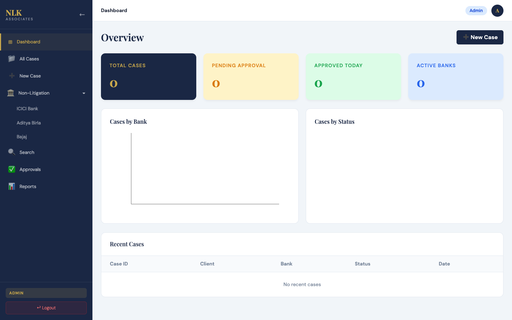
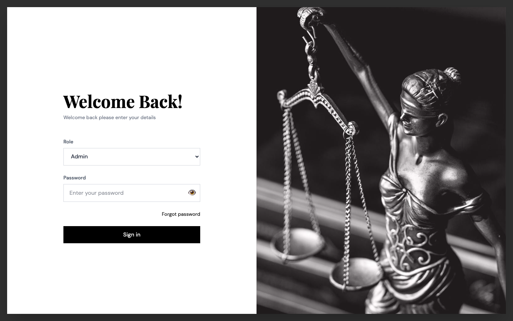
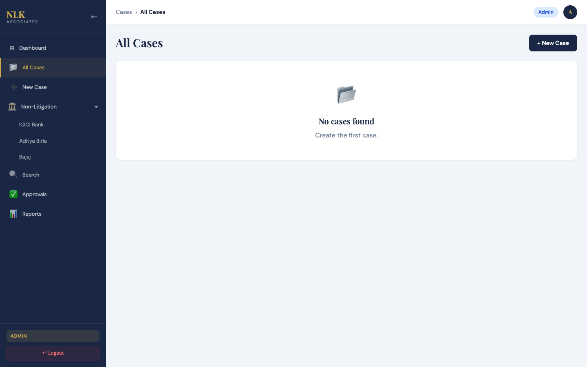
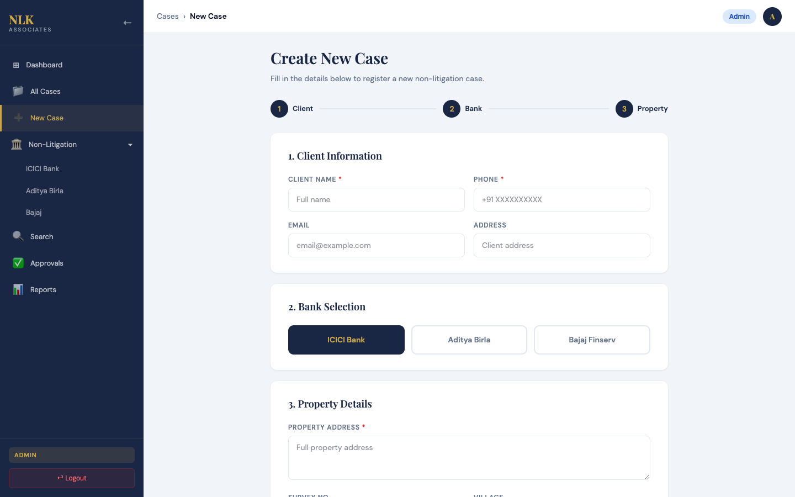
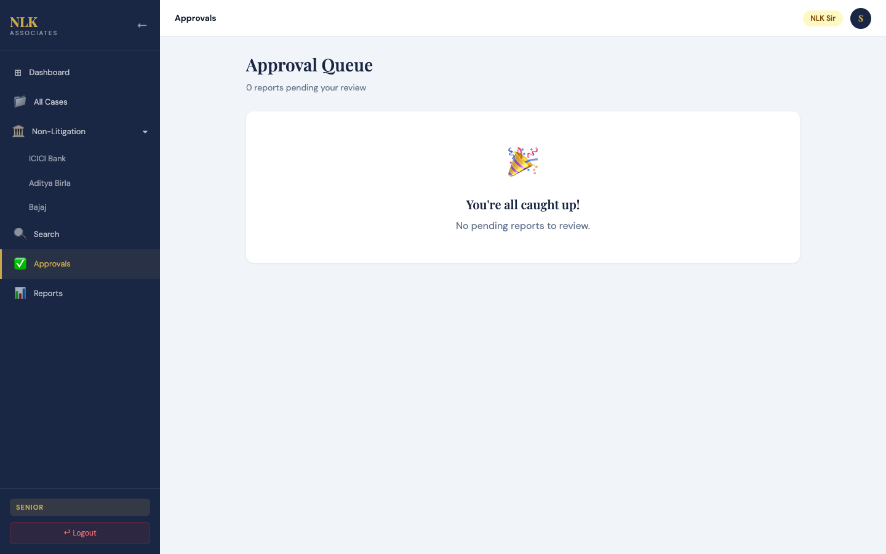

# NLK Associates Dashboard ⚖️

A comprehensive, full-stack legal case management and Non-Litigation AI Dashboard built for NLK Associates.



## 📋 Project Overview

The NLK Associates Dashboard aims to digitize and streamline the workflow for property title search reports (TSR), case management, and multi-tier legal approvals. It heavily utilizes AI to draft complex legal documents automatically based on inputted property details.

This repository holds **Phase 1: Non-Litigation Core Workflow**, which allows Admins to create cases, Staff to upload legal documents, AI to generate TSR drafts, and Senior Advocates to review, approve, and share these reports directly with associated banks.

## 🚀 Technology Stack

**Frontend:**
- **React.js 19** with **Vite**
- **Tailwind CSS v4** for utility-first styling
- **Recharts** for dashboard analytics graphics
- **React Router v7** for client-side navigation

**Backend:**
- **Node.js** & **Express**
- **MongoDB** (Mongoose ORM)
- **OpenAI API** (`gpt-4o-mini` for TSR generation)
- **Multer** for local document uploads
- **JSON Web Tokens (JWT)** for role-based authentication

---

## 📂 File Structure

```text
NLKAssociatesDashboard/
├── Backend/
│   ├── config/             # DB connection logic
│   ├── controllers/        # Route logic (Auth, Cases, TSR, Documents, Dashboard)
│   ├── middleware/         # JWT Auth Protect Middleware
│   ├── models/             # Mongoose schemas (Case, Client, Property, TSRReport, etc.)
│   ├── routes/             # Express API routers
│   ├── utils/              # Helper functions (generateToken)
│   ├── uploads/            # Local file storage for legal documents
│   ├── .env                # Environment variables (PORT, MONGO_URI, OPENAI_API_KEY, JWT_SECRET)
│   └── Server.js           # Express App Entry Point
│
├── Frontend/
│   ├── src/
│   │   ├── api/            # Axios instance configuration
│   │   ├── assets/         # Static images and SVGs
│   │   ├── components/     # Reusable UI (Sidebar, Header, Layout)
│   │   ├── pages/          # Feature Pages
│   │   │   ├── Dashboard.jsx
│   │   │   ├── Login.jsx
│   │   │   ├── Approvals/  # Senior review queue
│   │   │   ├── Cases/      # Case creation, details, list, and bank filters
│   │   │   ├── Reports/    # Shared history and generation
│   │   │   ├── Search/     # Global search view
│   │   │   └── TSR/        # AI generator interface
│   │   ├── App.jsx         # Router configuration
│   │   └── index.css       # Global styles and CSS variables
│   ├── package.json
│   └── vite.config.js
└── README.md
```

---

## 🔐 Role-Based Access Control

The platform implements strict RBAC to ensure legal data integrity and privacy:

1. **Admin** (`admin@123`): Full system control. The only role capable of creating new cases and altering core case statuses.
2. **Staff / Advocate** (`staff@123`): Responsible for handling active cases. Can upload documents and trigger the AI to generate initial TSR drafts.
3. **Senior Advocate** (`senior@123`): The approval authority (NLK Sir). Reviews AI drafts, requests changes, and provides final approval.



---

## 🎯 Phase 1 Completion (Current State)

The following core modules are **fully implemented and functional**:

- **Authentication System**: JWT-based login with dynamic UI rendering based on roles.
- **Dynamic Sidebar Routing**: Sidebar menus adapt based on the logged-in user's role.
- **Case Management (`/cases`)**:
  - Global case list with status badges.
  - Multi-step **New Case Creation Form** (Admin-only).
  - Detailed case view with drag-and-drop document uploads.
- **Bank-Specific Views (`/non-litigation/:bank`)**: Filtered views for ICICI, Aditya Birla, and Bajaj.
- **AI TSR Generator (`/tsr/:caseId`)**: Connects to OpenAI to draft a multi-section legal Title Search Report using case context.
- **Approvals Queue (`/approvals`)**: Senior-only dashboard to review, approve, or reject drafts with inline viewing.
- **Global Search (`/search`)**: Multi-filter capability (Bank, Status, Keyword).
- **Reports & Dispatch (`/reports`)**: Centralized view for approved cases ready to be shared with banks.

### Feature Previews

**All Cases List:**


**Case Creation Form:**


**Senior Approvals Queue:**


---

## 🛠 Pending Implementations (Phase 2)

While Phase 1 core logic is complete, the following items remain for the next iteration:

1. **PDF Generation (PDFKit)**: Converting the final approved HTML/Markdown TSR drafts into stylized, legally compliant PDFs for download.
2. **Email Integration**: Connecting NodeMailer or SendGrid to directly email the generated PDFs to bank representatives from the Reports page.
3. **Cloud Storage Integration**: Migrating local `/uploads` via Multer to an S3 bucket (AWS) for scalable production storage.
4. **Litigation Module**: Building out the second half of the dashboard dedicated to active court cases, hearings, and dates.

---

## ⚙️ Setup & Installation

### Prerequisites
- Node.js (v18+)
- MongoDB Community Server (Running locally on `mongodb://localhost:27017`)
- OpenAI API Key

### Backend Setup
1. Navigate to the Backend folder: `cd Backend`
2. Install dependencies: `npm install`
3. Create a `.env` file based on the template:
```env
PORT=5555
MONGO_URI=mongodb://localhost:27017/NLKAssociates
JWT_SECRET=your_jwt_secret_here
OPENAI_API_KEY=sk-your-openai-key
```
4. Start the server: `npm run dev` (or `node Server.js`)

### Frontend Setup
1. Navigate to the Frontend folder: `cd Frontend`
2. Install dependencies: `npm install`
3. Start Vite dev server: `npm run dev`
4. Access at `http://localhost:5173`

*(Note: The Frontend uses `axios.create` pointing to `http://localhost:5555/api` by default).*
